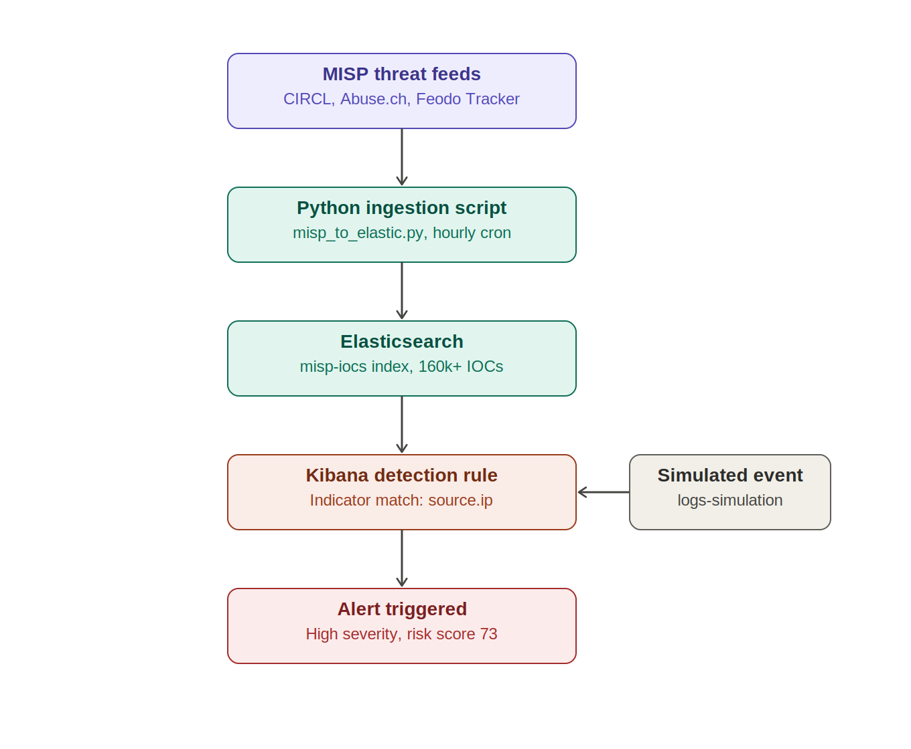
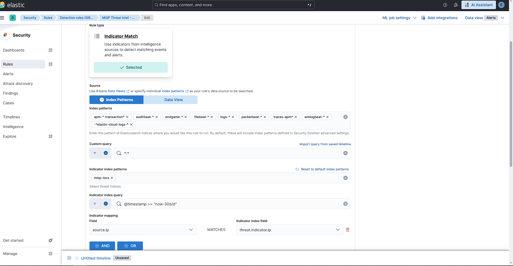
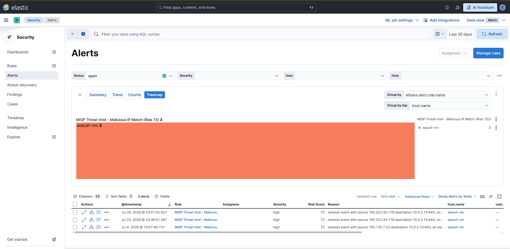
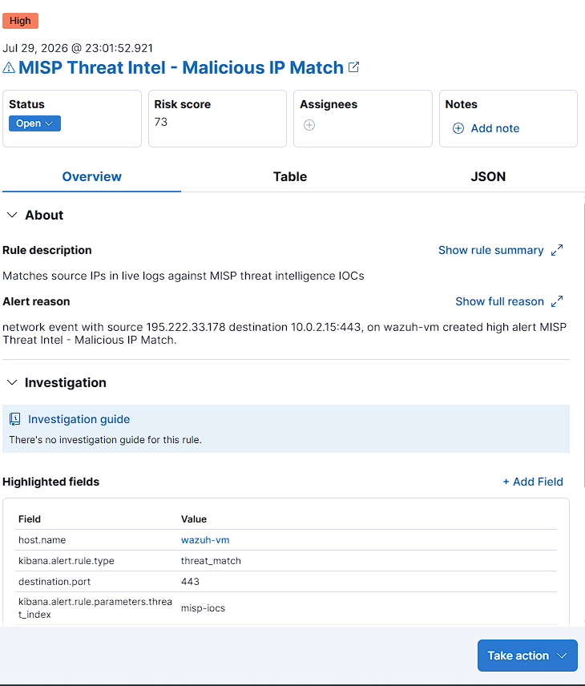

# Threat Intelligence SIEM Lab

A home lab SIEM built with Elastic Stack and MISP threat intelligence, demonstrating end-to-end blue team capabilities from IOC ingestion to real-time alert generation.

## Architecture

```
MISP Threat Feeds (CIRCL, Abuse.ch, Botvrij.eu)
         ↓
  Python Ingestion Script (misp_to_elastic.py)
         ↓
  Elasticsearch (misp-iocs index, 160,000+ IOCs)
         ↓
  Kibana Detection Rules (Indicator Match)
         ↓
  Security Alerts Dashboard
```

## Stack

| Component | Role |
|-----------|------|
| MISP | Threat intelligence platform — aggregates IOC feeds |
| Elasticsearch 8.x | SIEM backend — stores logs and threat intel |
| Kibana | SIEM frontend — detection rules and alert dashboard |
| Filebeat | Log ingestion — system, auth, and network logs |
| Python 3 | Custom ETL script — MISP → Elasticsearch pipeline |
| VirtualBox | VM hosting on Windows host (16GB RAM) |

## Features

- **160,000+ IOCs** ingested from MISP feeds including CIRCL, Abuse.ch URLhaus, Feodo Tracker, and Botvrij.eu
- **ECS-compliant** threat indicator mapping (`threat.indicator.*` fields)
- **Automated hourly ingestion** via cron job
- **Indicator Match detection rule** correlating live logs against known malicious IPs
- **Real-time alerting** with severity scoring and risk scores in Kibana Security
- **State tracking** to avoid duplicate indexing across runs

## Detection Rules

| Rule | Type | Severity |
|------|------|----------|
| MISP Threat Intel - Malicious IP Match | Indicator Match | High |

## IOC Types Supported

- IP addresses (source/destination)
- Domains and hostnames
- URLs
- File hashes (MD5, SHA1, SHA256)
- Email addresses
- Filenames

## Project Structure

## Key Skills Demonstrated

- SIEM architecture and deployment
- Threat intelligence platform integration (MISP)
- Elastic Common Schema (ECS) field mapping
- Custom ETL pipeline development (Python)
- Detection engineering (Indicator Match rules)
- SOC alert triage workflow

## Environment

- **Host:** Windows, VirtualBox
- **MISP VM:** Ubuntu, Apache, MySQL
- **SIEM VM:** Ubuntu 24, Elasticsearch 8.x, Kibana, Filebeat
- **RAM:** 8GB per VM, Elasticsearch JVM heap capped at 1GB

## Attack & Detect

To validate that the threat intelligence pipeline could actually detect real-world threats — not just store them — I ran an end-to-end attack simulation against my own detection rule.

### Architecture



MISP threat feeds (CIRCL, Abuse.ch, Feodo Tracker, Botvrij.eu) are pulled hourly via a custom Python script (`misp_to_elastic.py`) into an Elasticsearch index (`misp-iocs`), currently holding 160,000+ indicators mapped to ECS `threat.indicator.*` fields. A Kibana Indicator Match rule continuously checks incoming network events against this index.

### Simulating the attack

Rather than risk contacting a live malicious IP, I selected a real indicator already present in `misp-iocs` (`195.222.33.178`, tagged as a known malicious download location) and injected a synthetic network connection log referencing it directly into Elasticsearch — simulating what a compromised host's traffic would look like.

### Detection rule configuration

The **"MISP Threat Intel - Malicious IP Match"** rule matches `source.ip` against `threat.indicator.ip`, using `misp-iocs` as its indicator index.



### Alert triggered

Running the rule against the simulated event correctly triggered a **High severity alert (risk score 73)**.



Drilling into the alert confirms the exact match: a network event with source `195.222.33.178` and destination `10.0.2.15:443` on `wazuh-vm` triggered the rule, which is described as matching *"source IPs in live logs against MISP threat intelligence IOCs."*



### Why this matters

Threat intelligence is only useful if it's operationalized. Many home labs stop at "I ingested some IOCs into a SIEM." This project closes the loop by proving that ingested intelligence can actually detect a matching event in near real time — the same workflow a SOC analyst relies on when triaging an indicator match alert in production.
